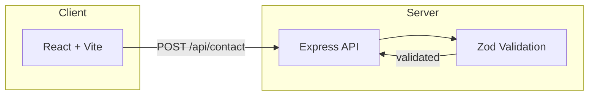

Matheus Daher — Portfolio

Full-stack portfolio showcasing projects built with TypeScript, React, and Node.js.

**[View Live](https://portfolio-git-main-matheus-projects-cba512cb.vercel.app/)**

---

## Overview

This portfolio presents my work as a Full-Stack Developer: featured projects, technical skills, and contact information. The site is a monorepo with a React frontend and an Express API backend for form handling and validation.

---

## Architecture



- **Frontend:** React SPA served via Vite. Displays projects, resume snapshot, and contact form.
- **Backend:** Express API with CORS, JSON parsing, and Zod schema validation for the contact endpoint.
- **Deployment:** Frontend on Vercel; backend can run on any Node.js host.

---

## Tech Stack

| Layer   | Technologies                          |
|---------|--------------------------------------|
| Frontend| React, TypeScript, Vite, CSS Modules |
| Backend | Node.js, Express, Zod                |
| Tools   | Git, npm, concurrently               |

---

## How to Run Locally

**Prerequisites:** Node.js 18+

```bash
# Clone and install
git clone https://github.com/mthsdaher/portfolio.git
cd portfolio
npm install

# Run frontend + backend
npm run dev
```

- **Frontend:** http://localhost:5173
- **Backend:** http://localhost:3001

**Run separately:**
```bash
npm run dev:front   # frontend only
npm run dev:back    # backend only
```

---

## Future Improvements

- [ ] Add contact form submission (email integration or serverless function)
- [ ] Add dark/light theme toggle
- [ ] Add project screenshots carousel
- [ ] Add blog or writing section

---

## Links

[GitHub](https://github.com/mthsdaher) · [LinkedIn](https://www.linkedin.com/in/matheus-daher/) · [Resume](/resume/Matheus_Daher_Resume.tex)
