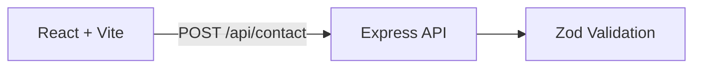
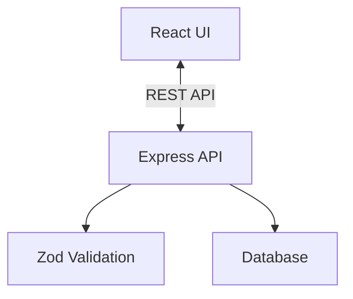
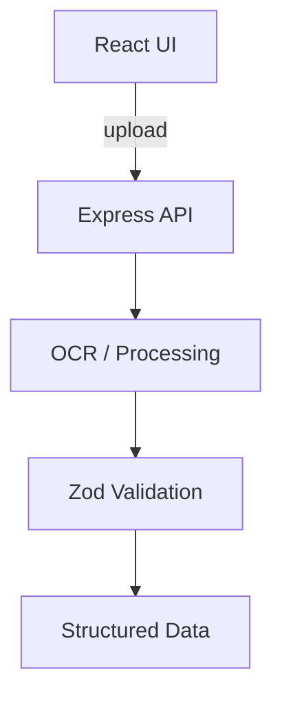

# Matheus Daher

Full-Stack Developer · TypeScript, React, Node.js

[LinkedIn](https://www.linkedin.com/in/matheus-daher/) · [Portfolio](https://portfolio-git-main-matheus-projects-cba512cb.vercel.app/)

---

*Featured below are my main and most recent projects. More available on my [GitHub](https://github.com/mthsdaher).*

---

## Portfolio

Full-stack portfolio site with React frontend and Express API backend.

**[View Live](https://portfolio-git-main-matheus-projects-cba512cb.vercel.app/)**

| | |
|---|---|
| **Stack** | React, TypeScript, Vite, Express, Zod |
| **Architecture** | React SPA → Express API (contact form, validation) |



**Run locally:**
```bash
git clone https://github.com/mthsdaher/portfolio.git && cd portfolio
npm install && npm run dev
```

---

## Agendamento Unique

Centralized booking platform for courts, events, and parties with conflict prevention.

**[Live Demo](https://agendamento-unique-655344779408.northamerica-northeast2.run.app/)**

| | |
|---|---|
| **Stack** | TypeScript, React, Node.js, Express, Zod, Google Cloud Run |
| **Features** | Availability management, conflict prevention, reservation flows |



---

## Receipt Scanner

OCR-based receipt processing that converts images into structured expense data.

**[GitHub](https://github.com/mthsdaher/receipt-scanner)**

| | |
|---|---|
| **Stack** | TypeScript, React, Node.js, Express, Zod |
| **Features** | OCR extraction, typed validation, searchable records |



---

## Links

[GitHub](https://github.com/mthsdaher) · [LinkedIn](https://www.linkedin.com/in/matheus-daher/) · [Portfolio](https://portfolio-git-main-matheus-projects-cba512cb.vercel.app/)
